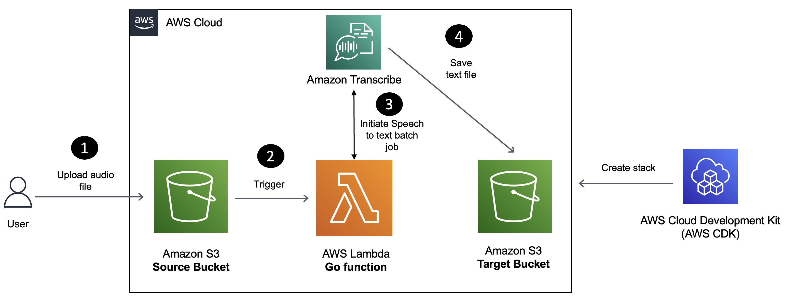

# Build a Serverless Application for Audio to Text conversion

In this tutorial, you will learn how to build a Serverless application for speech (audio) to text conversion using Amazon Transcribe, [AWS Lambda](https://aws.amazon.com/lambda/?sc_channel=el&sc_campaign=datamlwave&sc_content=audio-to-text-transcribe-lambda-golang&sc_geo=mult&sc_country=mult&sc_outcome=acq) and the [Go](https://go.dev/) programming language.

[Amazon Transcribe](https://docs.aws.amazon.com/transcribe/latest/dg/what-is.html?sc_channel=el&sc_campaign=datamlwave&sc_content=audio-to-text-transcribe-lambda-golang&sc_geo=mult&sc_country=mult&sc_outcome=acq) is a service that utilizes machine learning models to convert speech to text automatically. It offers various features that can enhance the accuracy of the transcribed text, such as language customization, content filtering, multi-channel audio analysis, and individual speaker speech partitioning. Amazon Transcribe can be used as a standalone transcription service or to add speech-to-text capabilities to any application. You can transcribe media in real time (streaming) or you can transcribe media files located in an [Amazon S3](https://docs.aws.amazon.com/AmazonS3/latest/userguide/Welcome.html?sc_channel=el&sc_campaign=datamlwave&sc_content=audio-to-text-transcribe-lambda-golang&sc_geo=mult&sc_country=mult&sc_outcome=acq) bucket (batch).

Here is how the application works:

1. MP3 audio files uploaded to a `S3` bucket will trigger a Lambda function.
2. The Lambda function will submit an asynchronous job to Amazon Transcribe which will finally store the resulting file (containing the converted text) in another `S3` bucket.

## Security

See [CONTRIBUTING](CONTRIBUTING.md#security-issue-notifications) for more information.

## License

This library is licensed under the MIT-0 License. See the LICENSE file.

